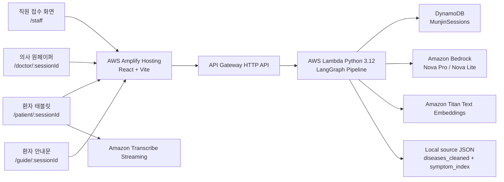

# 문진톡톡 (MunjinTalkTalk)

문진톡톡은 고령 환자의 음성 문진을 진료 전 의료진 원페이퍼와 진료 후 환자 안내문으로 연결하는 AI 문진 MVP입니다. 접수처에서 환자 세션을 만들고, 환자는 태블릿에서 음성으로 문진을 진행하며, 의료진은 구조화된 증상·문맥·질문·확인 항목을 한 화면에서 검토합니다.

이 저장소는 화면 목업만 포함한 저장소가 아닙니다. React/Vite 프론트엔드와 AWS 서버리스 백엔드, Bedrock 기반 LLM 파이프라인, Pydantic 검증, BM25 + Titan Embedding 기반 Hybrid IR, DynamoDB 세션 저장 구조를 포함합니다.

문진톡톡은 진단, 처방, 질병 예측 서비스를 제공하지 않습니다. 환자 발화를 의료진이 확인하기 쉬운 자료로 정리하는 진료 보조 도구이며, 최종 판단은 의료진에게 있습니다.

---

## 프로젝트 상태

| 항목 | 상태 |
| --- | --- |
| 접수처 세션 생성 | 구현됨 |
| 환자 태블릿 음성 문진 | 구현됨 |
| Amazon Transcribe Streaming | 구현됨. 환자 음성 파일 S3 저장 없음 |
| Bedrock 기반 의미 추출 | 구현됨 |
| Pydantic fixed schema 검증 | 구현됨 |
| source_quote 원문 근거 검증 | 구현됨 |
| LangGraph 파이프라인 | 구현됨 |
| BM25 + Titan Vector Hybrid IR | 구현됨 |
| 의료진 원페이퍼 | 구현됨 |
| 의사 답변 기반 환자 안내문 | 구현됨 |
| 인증·권한 분리 | MVP 범위 밖. 공개 테스트 전 필요 |
| 실제 EMR 연동 | MVP 범위 밖 |
| 강원 방언 RAG | 계획 단계 |

---

## 문제 정의

고령 환자의 진료 전 문진에서는 다음 문제가 반복적으로 발생합니다.

| 문제 | 현장 영향 | 문진톡톡의 처리 방식 |
| --- | --- | --- |
| 구어체·사투리 표현 | "코가 맥혀요", "목이 칼칼해요" 같은 표현이 표준 증상명으로 바로 정리되지 않음 | LLM이 표준어 의미로 정리하되 원문 quote를 함께 저장 |
| 환자 질문 누락 | 복약, 영양제, 재내원 기준 등 중요한 질문이 진료실에서 빠질 수 있음 | Q4 발화를 agenda로 분리하여 의사 답변 입력 영역에 표시 |
| 짧은 진료 시간 | 의료진이 주호소, 경과, 복약, 질문을 다시 물어야 함 | 진료 전 원페이퍼에 증상·문맥·확인 항목·EMR 초안을 제공 |
| 문진표 접근성 | 고령 환자가 긴 텍스트 문진표를 입력하기 어려움 | 태블릿 화면과 음성 중심 인터페이스 제공 |
| LLM 신뢰성 | LLM이 원문에 없는 증상이나 수치를 생성할 위험 | Pydantic schema, enum, source_quote 검증, retry loop로 제한 |

---

## 사용자 흐름

```text
직원 접수
  -> 환자 태블릿 음성 문진
  -> 실시간 STT
  -> LLM 의미 추출과 schema 검증
  -> Hybrid IR 표준 증상 매칭
  -> 원페이퍼 생성
  -> 의료진 확인과 답변 입력
  -> 환자 안내문 출력
```

### 1. 직원 접수

접수처 직원은 환자 기본 정보를 입력하고 문진 세션을 생성합니다.

- 이름
- 생년월일
- 성별
- 진료과
- 담당 의사
- 연락처
- 초진/재진 여부

세션 생성 후 `session_id`가 만들어지며, 이 값이 환자 태블릿, 의사 원페이퍼, 안내문 화면을 연결합니다.

### 2. 환자 태블릿 문진

환자는 태블릿에서 초진 또는 재진 질문을 순서대로 답합니다. 브라우저는 마이크 음성을 Amazon Transcribe Streaming WebSocket으로 전송하고, 최종 텍스트만 백엔드 `/process-answer`로 전달합니다.

초진 질문:

| 질문 | 목적 |
| --- | --- |
| Q1. 어디가 불편하셔서 오셨어요? | 주호소와 주요 증상 추출 |
| Q2. 그 증상은 언제부터 그러셨어요? | 시작 시점과 경과 문맥 추출 |
| Q3. 지금 드시는 약이 있으세요? | 복약, 영양제, 무복약 여부 확인 |
| Q4. 의사선생님께 묻고 싶은 점이 있으세요? | 환자 질문 agenda 분리 |

재진 질문:

| 질문 | 목적 |
| --- | --- |
| Q1. 지난번 진료 이후 어떻게 지내셨어요? | 증상 변화와 경과 확인 |
| Q2. 처방받은 약은 잘 드시고 계세요? | 복약 순응도 확인 |
| Q3. 그동안 새로 생긴 증상은 없으세요? | 새 증상, 악화, 위험 표현 확인 |
| Q4. 지난번에 못 여쭤본 점이 있으신가요? | 추가 질문 분리 |

### 3. 백엔드 처리

환자 답변 하나는 LangGraph 파이프라인에서 다음 순서로 처리됩니다.

1. 필수 입력 확인
2. 위험 표현 quick safety flag
3. Bedrock Nova 기반 의미 분할과 표준화
4. Pydantic fixed schema 검증
5. `source_quote` 원문 포함 여부 검증
6. 증상 문항이면 Hybrid IR 매칭
7. DynamoDB 세션 저장
8. 원페이퍼 갱신
9. 처리 trace 반환

### 4. 의료진 원페이퍼

의사는 원페이퍼에서 다음 정보를 확인합니다.

- 오늘 말한 불편함
- 환자 원문 quote
- 표준 증상 매칭 여부
- 증상 맥락 chip
- 환자 질문과 답변 입력 영역
- 의료진 확인 항목
- EMR 복사용 문장
- 환자 안내 강조사항

원페이퍼의 증상 카드에는 숫자형 confidence를 표시하지 않습니다. 내부 `ir_trace`에는 BM25, vector, label, rank score가 저장되지만, 의료진 UI에서는 “매칭됨” 또는 “우선 확인” 상태로만 표시합니다.

### 5. 환자 안내문

의사가 환자 질문에 답변하고 강조사항을 입력하면 안내문 화면에 정리됩니다.

- 환자 질문별 쉬운 답변
- 의사 강조사항
- 말로 재생하기 버튼
- 종이 출력용 화면

의사가 입력한 강조사항은 LLM이 변형하지 않고 원문 그대로 별도 카드에 표시합니다.

---

## 기술 아키텍처



---

## AI 처리 원칙

문진톡톡은 LLM이 모든 결정을 단독으로 내리는 구조가 아닙니다. LLM은 환자 발화를 fixed schema 안에 채우는 역할을 담당하고, 저장 전 검증 로직이 결과를 제한합니다.

| 단계 | 기술 | 역할 | 검증·제한 |
| --- | --- | --- | --- |
| 음성 인식 | Amazon Transcribe Streaming | 환자 음성을 한국어 텍스트로 변환 | 음성 파일 저장 없음 |
| 의미 추출 | Bedrock Nova Pro/Lite | 발화 의미 단위 분할, 표준화, 질문 분리 | Pydantic schema와 원문 quote 검증 |
| prompt/message 구성 | LangChain Core | Bedrock 메시지 형식 구성 | 프롬프트 계층 분리 |
| 파이프라인 제어 | LangGraph | 노드 순서, 분기, trace 관리 | active_path와 pipeline_trace 저장 |
| 증상 매칭 | BM25 + Titan Vector Hybrid IR | LLM 증상 후보를 표준 증상명과 매칭 | threshold와 ir_trace 기록 |
| 원페이퍼 리뷰 | Bedrock Nova Pro | 의료진 확인 항목과 EMR 초안 생성 | review schema 검증 |
| 안내문 변환 | Bedrock Nova Lite | 의사 답변을 환자 안내문으로 변환 | guide schema 검증 |

핵심 제한:

- LLM은 `score`, `confidence`, `probability` 같은 임의 수치를 생성할 수 없습니다.
- `source_quote`와 `original_quote`는 환자 원문에 실제 존재해야 합니다.
- 예상하지 않은 JSON 필드는 Pydantic에서 거부됩니다.
- 증상 매칭은 LLM 단독 판단이 아니라 원천 JSON 기반 Hybrid IR을 통과해야 합니다.
- rule-based fallback은 기본 운영 경로가 아닙니다. 기본값은 `ALLOW_RULE_FALLBACK=false`입니다.

---

## Hybrid IR 개요

증상 매칭은 두 원천 JSON과 사전 계산된 embedding cache를 사용합니다.

```text
backend/serverless/src/data/diseases_cleaned.json
backend/serverless/src/data/symptom_index.json
backend/serverless/src/data/symptom_embeddings_amazon.titan-embed-text-v2_0_512.json
```

처리 순서:

1. LLM extraction이 증상 span을 생성합니다.
2. span의 `source_quote`, `normalized_text`, `name`, `slot_ref`를 query로 구성합니다.
3. `symptom_index.json`과 `diseases_cleaned.json`에서 검색 문서를 deterministic하게 구성합니다.
4. BM25로 lexical 유사도를 계산합니다.
5. Titan embedding으로 semantic 유사도를 계산합니다.
6. 표준 증상명/alias 직접 일치 신호를 label score로 보조 반영합니다.
7. 채택 조건을 통과한 후보만 `matched_slots`에 저장합니다.
8. 내부 검토용 `ir_trace`에 BM25, vector, label, rank score를 남깁니다.

현재 alias는 호흡기 MVP 범위의 제한적 bridge mapping입니다. 장기적으로는 표준 증상 인덱스 기반 alias registry와 provenance 관리가 필요합니다.

---

## 저장소 구조

```text
munjin-talk-talk-mvp/
├── README.md
├── amplify.yml
├── frontend/
│   ├── README.md
│   ├── package.json
│   └── src/
│       ├── App.jsx
│       ├── components/
│       ├── hooks/
│       ├── services/
│       ├── config/
│       └── styles/
├── backend/
│   ├── README.md
│   └── serverless/
│       ├── README.md
│       ├── template.yaml
│       └── src/
│           ├── handler.py
│           ├── pipeline_graph.py
│           ├── pipeline_nodes.py
│           ├── extraction.py
│           ├── retrieval.py
│           ├── onepager.py
│           ├── guide.py
│           ├── schemas/
│           └── data/
└── docs/
    ├── PROJECT_STRUCTURE.md
    ├── LANGGRAPH_PIPELINE.md
    ├── DATA_SCHEMA.md
    ├── MVP_SETUP.md
    ├── DEPLOYMENT.md
    ├── architecture.drawio
    ├── architecture.svg
    └── technical-guide.html
```

---

## 문서 지도

| 문서 | 목적 |
| --- | --- |
| [frontend/README.md](frontend/README.md) | 프론트엔드 화면, 라우팅, STT, API 연동 설명 |
| [backend/README.md](backend/README.md) | 백엔드 책임, LangGraph, LLM, IR, 저장 구조 설명 |
| [backend/serverless/README.md](backend/serverless/README.md) | SAM 배포, API endpoint, 환경 변수, 스모크 테스트 |
| [docs/README.md](docs/README.md) | 세부 문서 목록 |
| [docs/PROJECT_STRUCTURE.md](docs/PROJECT_STRUCTURE.md) | 파일별 역할과 수정 위치 |
| [docs/LANGGRAPH_PIPELINE.md](docs/LANGGRAPH_PIPELINE.md) | 환자 답변 1개가 처리되는 노드 흐름 |
| [docs/DATA_SCHEMA.md](docs/DATA_SCHEMA.md) | DynamoDB, extraction, onepaper, guide JSON 구조 |
| [docs/MVP_SETUP.md](docs/MVP_SETUP.md) | 로컬 실행과 test 환경 점검 |
| [docs/DEPLOYMENT.md](docs/DEPLOYMENT.md) | Amplify와 SAM 배포 절차 |
| [docs/technical-guide.html](docs/technical-guide.html) | 발표·공유용 기술 설명 페이지 |

---

## 로컬 실행

프론트엔드 실행:

```powershell
cd frontend
npm install
Copy-Item .env.example .env.local
npm run dev -- --host 127.0.0.1 --port 5173
```

브라우저:

```text
http://127.0.0.1:5173/staff
```

AWS 백엔드 연결 시 `frontend/.env.local`:

```text
VITE_API_BASE_URL=https://<api-id>.execute-api.<region>.amazonaws.com
VITE_ENABLE_MOCKS=false
```

UI 목업 모드:

```text
VITE_API_BASE_URL=
VITE_ENABLE_MOCKS=true
```

---

## AWS 배포 개요

백엔드:

```powershell
cd backend/serverless
sam build
sam deploy --guided
```

프론트엔드 Amplify 설정:

```text
Repository: <owner>/<repository>
Branch: main 또는 test
Monorepo app root: frontend
Build command: npm run build
Build output directory: dist
Environment variable:
  VITE_API_BASE_URL=https://<api-id>.execute-api.<region>.amazonaws.com
```

SPA rewrite:

```json
[
  {
    "source": "/<*>",
    "status": "404-200",
    "target": "/index.html"
  }
]
```

---

## 검증 명령

프론트엔드:

```powershell
cd frontend
npm run build
```

백엔드 Python syntax:

```powershell
py -3.12 -m compileall backend/serverless/src
```

SAM build:

```powershell
cd backend/serverless
sam build
```

Windows에서 SAM CLI가 Python 3.12을 찾지 못하면 Python 3.12 설치 경로를 `PATH`에 추가한 뒤 다시 실행합니다.

---

## 개인정보와 보안 기준

현재 저장소는 MVP 검증용입니다. 실제 환자 데이터로 공개 테스트하기 전 다음 항목이 필요합니다.

- 직원/의사 화면 인증
- 역할 기반 접근 제어
- DynamoDB TTL 또는 보존 기간 정책
- CloudWatch Logs 보존 기간 정책
- API Gateway throttling
- WAF 또는 접근 제한
- 환자 동의 문구
- 개인정보 처리 기준
- 실제 병원 업무망과의 배포 경계 검토

현재 구현에서 환자 음성은 S3에 저장하지 않습니다. 다만 DynamoDB에는 문진 텍스트와 원페이퍼 JSON이 저장되므로 실제 개인정보를 입력하려면 별도 보안 검토가 필요합니다.

---

## 공개 저장소 주의사항

저장소에 포함하지 않아야 하는 항목:

- `.env`, `.env.local`
- AWS access key 또는 secret key
- SAM `samconfig.toml`
- `.aws-sam/`
- `frontend/node_modules/`
- `frontend/dist/`
- 실제 환자 데이터
- 실제 API Gateway endpoint를 고정한 문서

현재 `.gitignore`는 위 항목 대부분을 제외하도록 구성되어 있습니다.

---

## 팀

| 역할 | 이름 |
| --- | --- |
| 리더 | 최기범 |
| 팀원 | 김원재, 방정호, 서지민, 박나현 |

---

## 면책 조항

문진톡톡은 의료적 진단, 처방, 질병 예측을 수행하지 않습니다. 본 프로젝트는 환자 발화를 구조화하여 의료진의 확인을 돕는 MVP이며, 모든 진료 판단은 의료진이 수행해야 합니다.
