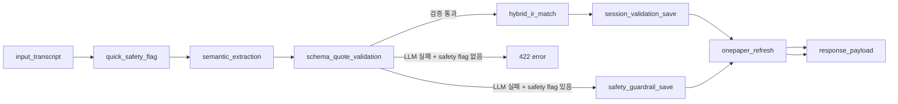

# 문진톡톡 Serverless Backend

이 디렉터리는 문진톡톡 MVP의 AWS 서버리스 백엔드 배포 단위입니다. AWS SAM으로 API Gateway HTTP API와 Python 3.12 Lambda를 배포하며, DynamoDB, Amazon Transcribe Streaming, Amazon Bedrock, Amazon Titan Text Embeddings를 사용합니다.

---

## 구성 요약

```text
React/Vite frontend
  -> API Gateway HTTP API
  -> Lambda Python 3.12
  -> DynamoDB session table
  -> Amazon Transcribe Streaming
  -> Amazon Bedrock Nova Pro/Lite
  -> Amazon Titan Text Embeddings
```

핵심 원칙:

- 환자 음성 파일은 S3에 저장하지 않습니다.
- 프론트엔드는 Transcribe Streaming WebSocket으로 음성을 직접 전송합니다.
- 백엔드는 최종 transcript 텍스트만 받아 LLM, validation, IR, onepaper 처리를 수행합니다.
- LLM JSON은 Pydantic schema와 source_quote 검증을 통과해야 저장됩니다.
- 의료진 UI에 숫자형 증상 confidence를 표시하지 않습니다. IR 점수는 내부 trace로만 남깁니다.

---

## 디렉터리 구조

```text
backend/serverless/
├── README.md
├── template.yaml
└── src/
    ├── handler.py
    ├── common.py
    ├── settings.py
    ├── sessions.py
    ├── audio.py
    ├── llm.py
    ├── langchain_prompting.py
    ├── orchestration.py
    ├── pipeline_graph.py
    ├── pipeline_nodes.py
    ├── pipeline_state.py
    ├── pipeline_trace.py
    ├── extraction.py
    ├── extraction_prompts.py
    ├── extraction_schema.py
    ├── extraction_fallback.py
    ├── retrieval.py
    ├── retrieval_documents.py
    ├── retrieval_embeddings.py
    ├── retrieval_scoring.py
    ├── clinical_terms.py
    ├── onepager.py
    ├── onepager_sections.py
    ├── onepager_review.py
    ├── guide.py
    ├── schemas/
    └── data/
```

로컬 산출물:

- `.aws-sam/`: SAM build 결과. Git 제외 대상
- `samconfig.toml`: 개인 AWS 배포 설정. Git 제외 대상

---

## API endpoint

| Method | Path | 역할 |
| --- | --- | --- |
| `POST` | `/sessions` | 접수처에서 문진 세션 생성 |
| `GET` | `/sessions/{session_id}` | 특정 세션 조회 |
| `POST` | `/sessions/{session_id}/staff-help` | 환자 태블릿 직원 도움 요청 |
| `POST` | `/transcribe-stream-url` | Transcribe Streaming presigned WebSocket URL 발급 |
| `POST` | `/process-answer` | 환자 답변 1개를 LangGraph 파이프라인으로 처리 |
| `POST` | `/extract` | LLM extraction 단독 테스트 |
| `POST` | `/match` | Hybrid IR 단독 테스트 |
| `POST` | `/validate` | 저장/원페이퍼 갱신 단독 테스트 |
| `GET` | `/doctor/queue` | 의사 대기열 조회 |
| `GET` | `/onepager/{session_id}` | 원페이퍼 조회 |
| `POST` | `/doctor-response` | 의사 답변과 환자 강조사항 저장 |
| `GET` | `/guide/{session_id}` | 환자 안내문 조회 |

저장형 음성 업로드와 배치 Transcribe 조회 endpoint는 제거했습니다. 현재 문진 음성은 `/transcribe-stream-url`로 발급받은 Transcribe Streaming WebSocket에서만 처리합니다.

---

## Lambda 내부 모듈

### API와 설정

| 파일 | 역할 |
| --- | --- |
| `handler.py` | Lambda entrypoint. API Gateway method/path 라우팅 |
| `common.py` | 과거 import 호환용 facade |
| `settings.py` | 환경 변수, 모델 ID, AWS client, 데이터 경로 |
| `sessions.py` | DynamoDB session 저장·조회·queue 변환 |

### 음성 인식

| 파일 | 역할 |
| --- | --- |
| `audio.py` | Transcribe Streaming presigned WebSocket URL 생성 |

### LLM과 prompt

| 파일 | 역할 |
| --- | --- |
| `llm.py` | Bedrock Runtime JSON 호출 공통 함수 |
| `langchain_prompting.py` | LangChain Core 기반 Bedrock message 구성 |
| `extraction_prompts.py` | 문항별 extraction prompt와 모델 라우팅 |
| `onepager_review.py` | 의료진 확인 항목, EMR 초안, final review |
| `guide.py` | 환자 안내문 생성 |

### LangGraph 파이프라인

| 파일 | 역할 |
| --- | --- |
| `orchestration.py` | `/process-answer` 진입점 |
| `pipeline_graph.py` | LangGraph 노드 연결과 조건 분기 |
| `pipeline_nodes.py` | 노드별 실제 처리 로직 |
| `pipeline_state.py` | 파이프라인 state type과 graph 설명 |
| `pipeline_trace.py` | trace, active_path, orchestration snapshot 저장 |

### Schema validation

| 파일 | 역할 |
| --- | --- |
| `schemas/extraction.py` | 문항별 LLM extraction schema |
| `schemas/review.py` | 원페이퍼 review LLM schema |
| `schemas/guide.py` | 환자 안내문 LLM schema |
| `extraction_schema.py` | runtime 기본값 보강, quote grounding, 문항 단위 검증 |

### Hybrid IR

| 파일 | 역할 |
| --- | --- |
| `clinical_terms.py` | 안전 키워드, 제한적 alias bridge, symptom slot helper |
| `retrieval.py` | 증상 후보 검색과 채택 판정 |
| `retrieval_documents.py` | 원천 JSON을 검색 문서로 변환 |
| `retrieval_embeddings.py` | Titan embedding 호출과 cache |
| `retrieval_scoring.py` | BM25, cosine, label score 계산 |
| `data/diseases_cleaned.json` | 질환/증상 원천 정제 데이터 |
| `data/symptom_index.json` | 표준 증상 인덱스 |
| `data/symptom_embeddings_*.json` | Titan embedding 사전 계산 cache |

---

## LangGraph 노드



상세 설명은 [docs/LANGGRAPH_PIPELINE.md](../../docs/LANGGRAPH_PIPELINE.md)를 참고합니다.

---

## AWS 리소스

### DynamoDB

세션 테이블:

```text
MunjinSessions 또는 환경별 테이블명
```

필수 key:

```text
session_id (String)
```

권장:

- On-demand billing
- 테스트 환경과 운영 환경 테이블 분리
- 실제 환자 데이터 사용 전 TTL 또는 삭제 정책 설정

### IAM Role

Lambda execution role에는 최소한 다음 권한이 필요합니다.

- CloudWatch Logs 작성
- DynamoDB `GetItem`, `PutItem`, `UpdateItem`, `Scan`
- Bedrock `InvokeModel`
- Transcribe Streaming `StartStreamTranscriptionWebSocket`
- SAM artifact bucket 접근

공개 운영 전에는 resource ARN을 환경별로 좁혀야 합니다.

### Bedrock model access

배포 region에서 다음 모델 권한을 확인합니다.

```text
apac.amazon.nova-pro-v1:0
apac.amazon.nova-lite-v1:0
amazon.titan-embed-text-v2:0
```

---

## 환경 변수

`template.yaml`에서 Lambda environment로 주입됩니다.

| 변수 | 기본값 | 설명 |
| --- | --- | --- |
| `SESSIONS_TABLE` | `MunjinSessions` | DynamoDB 세션 테이블 |
| `CUSTOM_VOCABULARY` | 빈 값 | Transcribe custom vocabulary |
| `USE_BEDROCK_LLM` | `true` | Bedrock LLM extraction 사용 |
| `ALLOW_RULE_FALLBACK` | `false` | LLM 실패 시 rule fallback 허용 |
| `ENABLE_BEDROCK_REVIEW` | `true` | 원페이퍼 review LLM 사용 |
| `ENABLE_BEDROCK_GUIDE` | `true` | 환자 안내문 LLM 사용 |
| `STRONG_MODEL_ID` | `apac.amazon.nova-pro-v1:0` | 고난도 extraction |
| `LIGHT_MODEL_ID` | `apac.amazon.nova-lite-v1:0` | 저난도 extraction |
| `REVIEWER_MODEL_ID` | `STRONG_MODEL_ID` | 원페이퍼 review |
| `GUIDE_MODEL_ID` | `LIGHT_MODEL_ID` | 환자 안내문 |
| `MAX_LLM_TOKENS` | `1600` | extraction max token |
| `REVIEW_MAX_TOKENS` | `900` | review max token |
| `GUIDE_MAX_TOKENS` | `900` | guide max token |
| `EXTRACTION_RETRY_ATTEMPTS` | `3` | extraction retry 횟수 |
| `REVIEW_RETRY_ATTEMPTS` | `2` | review retry 횟수 |
| `USE_TITAN_EMBEDDING` | `true` | Titan Vector IR 사용 |
| `EMBEDDING_MODEL_ID` | `amazon.titan-embed-text-v2:0` | embedding 모델 |
| `EMBEDDING_DIMENSIONS` | `512` | embedding 차원 |
| `HYBRID_BM25_WEIGHT` | `0.35` | 후보 정렬 시 BM25 비중 |
| `HYBRID_VECTOR_WEIGHT` | `0.65` | 후보 정렬 시 vector 비중 |

---

## 모델 라우팅

| 단계 | 기본 모델 |
| --- | --- |
| Q1 주호소 extraction | Nova Pro |
| 재진 경과·새 증상 extraction | Nova Pro |
| 복약·환자 질문 extraction | Nova Lite |
| 원페이퍼 review | Nova Pro |
| 환자 안내문 guide | Nova Lite |
| 증상 vector IR | Titan Text Embeddings v2 |

모델 라우팅은 `src/extraction_prompts.py`에서 정의합니다.

---

## LLM JSON 검증

LLM 출력은 다음 조건을 통과해야 합니다.

- JSON object여야 함
- fixed schema에 맞아야 함
- required field가 있어야 함
- enum 값이 허용 목록 안에 있어야 함
- 예상하지 않은 field가 없어야 함
- `source_quote`와 `original_quote`는 환자 원문의 연속 substring이어야 함
- LLM이 만든 `score`, `confidence`, `probability`, `risk percentage`가 없어야 함
- 증상 문항에서 환자가 명백히 증상 없다고 말하지 않았다면 grounded span이 최소 1개 있어야 함

검증 실패 시:

1. validation error를 repair prompt에 포함합니다.
2. 같은 transcript로 Bedrock에 다시 요청합니다.
3. 정해진 횟수까지 retry합니다.
4. 실패가 반복되면 저장하지 않고 422를 반환합니다.

---

## 배포

```powershell
cd backend/serverless
sam build
sam deploy --guided
```

입력 예시:

```text
Stack Name: munjin-mvp-backend-test
AWS Region: ap-northeast-2
Parameter SessionsTableName: MunjinSessionsTest
Parameter LambdaRoleArn: arn:aws:iam::<account-id>:role/<lambda-role-name>
Parameter CustomVocabularyName:
Confirm changes before deploy: y
Allow SAM CLI IAM role creation: n
MunjinApiFunction has no authentication. Is this okay?: y
```

배포 output:

```text
ApiEndpoint: https://<api-id>.execute-api.<region>.amazonaws.com
```

이 값을 프론트엔드 환경 변수에 설정합니다.

```text
VITE_API_BASE_URL=https://<api-id>.execute-api.<region>.amazonaws.com
```

---

## Windows SAM build 참고

SAM CLI가 Python 3.12을 찾지 못하는 환경에서는 Python 3.12 설치 경로를 `PATH`에 추가한 뒤 실행합니다.

예시:

```powershell
$env:SAM_CLI_TELEMETRY='0'
$env:APPDATA='<writable-appdata-path>'
$env:Path='<python-3.12-dir>;<python-3.12-scripts-dir>;' + $env:Path
sam build
```

개인 계정 경로나 실제 bucket/role 값은 문서와 Git에 고정하지 않습니다.

---

## 스모크 테스트

배포된 API endpoint를 넣어 기본 extraction과 IR을 확인합니다.

```powershell
@'
const API = 'https://<api-id>.execute-api.<region>.amazonaws.com';
const transcript = '\uC5B4\uC81C\uBD80\uD130 \uBAA9\uC774 \uCE7C\uCE7C\uD558\uACE0 \uCF54\uAC00 \uB9C9\uD600\uC694.';

const sessionRes = await fetch(`${API}/sessions`, {
  method: 'POST',
  headers: { 'Content-Type': 'application/json; charset=utf-8' },
  body: JSON.stringify({
    visit_type: 'initial',
    patient: {
      full_name: '\uD14C\uC2A4\uD2B8\uD658\uC790',
      birth_date: '1950-09-17',
      gender: '\uC5EC\uC131',
      receipt_id: `T-${Date.now()}`,
      department: '\uC774\uBE44\uC778\uD6C4\uACFC',
      doctor: '\uD14C\uC2A4\uD2B8\uC758\uC0AC',
      phone: '010-0000-0000'
    }
  })
});

const session = await sessionRes.json();
const sessionId = session.session_id || session.sessionId;

const answerRes = await fetch(`${API}/process-answer`, {
  method: 'POST',
  headers: { 'Content-Type': 'application/json; charset=utf-8' },
  body: JSON.stringify({
    session_id: sessionId,
    question_id: 'Q1',
    question_type: 'chief_complaint',
    visit_type: 'initial',
    transcript
  })
});

const answer = await answerRes.json();
console.log(JSON.stringify({
  status: answerRes.status,
  validator_passed: answer.validator_passed,
  spans: answer.spans,
  matched_slots: answer.matched_slots,
  path: answer.orchestration?.active_path
}, null, 2));
'@ | node --input-type=module -
```

정상 기준:

- HTTP status `200`
- `validator_passed: true`
- `spans`에 원문 quote 존재
- `matched_slots`에 표준 증상 매칭 결과 존재
- `active_path`에 `response_payload` 포함

---

## 로그 확인

AWS Console:

```text
CloudWatch
  -> Log groups
  -> /aws/lambda/<stack-name>-MunjinApiFunction-...
```

주요 확인 항목:

- Lambda import error
- Bedrock access denied
- Transcribe permission error
- DynamoDB table not found
- Pydantic validation error
- 422 response payload

---

## 보안 주의

현재 MVP API에는 직원/의사 인증이 없습니다. 실제 환자 데이터를 공개 URL로 입력하면 안 됩니다.

운영 전 필요 항목:

- Cognito 또는 내부 인증 연동
- 직원/의사 role-based access control
- DynamoDB TTL 또는 삭제 정책
- CloudWatch Logs 보존 기간 설정
- API Gateway throttling
- WAF 또는 IP 제한
- 환자 동의 절차
- 개인정보 처리 기준 검토

---

## 관련 문서

- [메인 README](../../README.md)
- [백엔드 README](../README.md)
- [프로젝트 구조](../../docs/PROJECT_STRUCTURE.md)
- [LangGraph 파이프라인](../../docs/LANGGRAPH_PIPELINE.md)
- [내부 JSON 스키마](../../docs/DATA_SCHEMA.md)
- [AWS 배포 가이드](../../docs/DEPLOYMENT.md)
